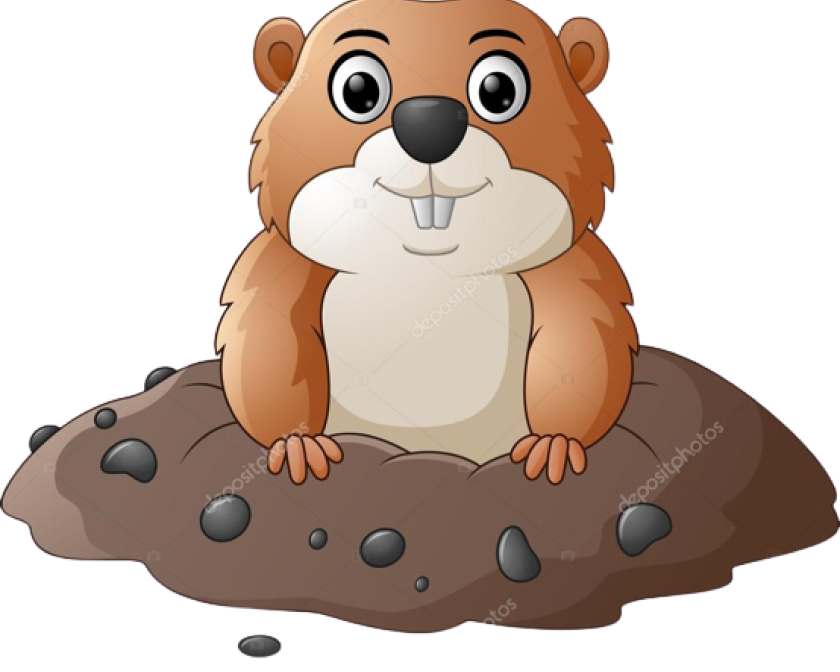

#wheel of moles
Para este proyecto nuestro objetivo es lograr un juego dinamico y creativo, que tenga una interfaz facil de entender para el usuario. 

###Mira el resultado!
https://wheel-of-doom.netlify.app


####html　
Contiene dos escenas, en la primera se encuentra la presentación del juego, 
```html
<body>
    <main>
    <h1>Wheel of Doom</h1>
    <button><a href="twoscene.html">START</a></button>  
    
    </main>
</body>
```
en la segunda ya podemos interactuar con la app
```html
<body>
    <div class="container">
        <div class="participantes">
            <div class="titlelist">
                <h2>PARTICIPANTES</h2>
            </div>
            <div>
                <form>
                    <input class="input" type="text" placeholder="Ingresa el nombre">
                    <button class="btnadd">+</button>
                </form>
                <div class="licontainer">
                    <ul>
//se guardara cada dato ingresado en la lista
                    </ul>
                </div>
            </div>
        </div>
        <div class="ruleta">
                <div>
                   <figure>
                       
                   </figure>
                </div>
        </div>
    </div>
    <script src="main.js"></script>
</body>
```
####JavaScript
guardamos cada dato ingresado y seleccionamos uno de forma aleatoria para ser sacrificado
```javascript
const entrada = document.querySelector("input")
const añadir = document.querySelector(".btnadd")
const ul = document.querySelector("ul")
let elegido = document.querySelector("figcaption")
let datos =[];

añadir.addEventListener("click", (e) => {
    e.preventDefault();
    const text =entrada.value
    if(text !==""){
        const li = document.createElement("li")
        const p = document.createElement("p")
        p.textContent=text
        li.appendChild(p)
        li.appendChild(addDeleteBtn())
        ul.appendChild(li)
        entrada.value=""
        datos.push(p.textContent);
    } 
});

function seleccionarDatosAzar(datos){
    return datos[Math.floor(Math.random() * datos.length)]
}


const addDeleteBtn = () =>{
    const deleteBtn = document.createElement("button")
    deleteBtn.textContent="x"
    deleteBtn.className = "btnDelete"

    deleteBtn.addEventListener("click", (e)=>{
        const parentBtn = e.target.parentElement
        ul.removeChild(parentBtn);
        const nombrea = document.querySelectorAll("li")
    })
    return deleteBtn
}
